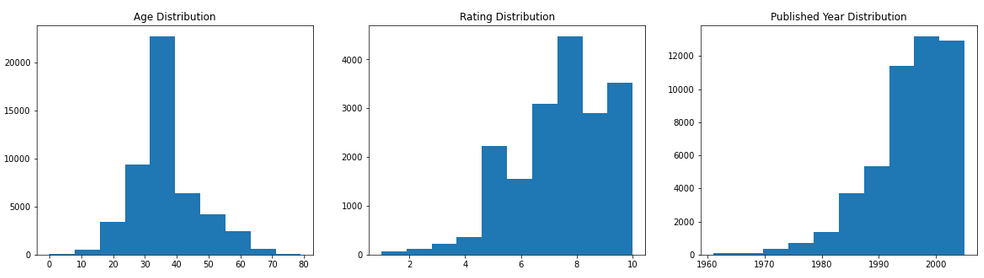
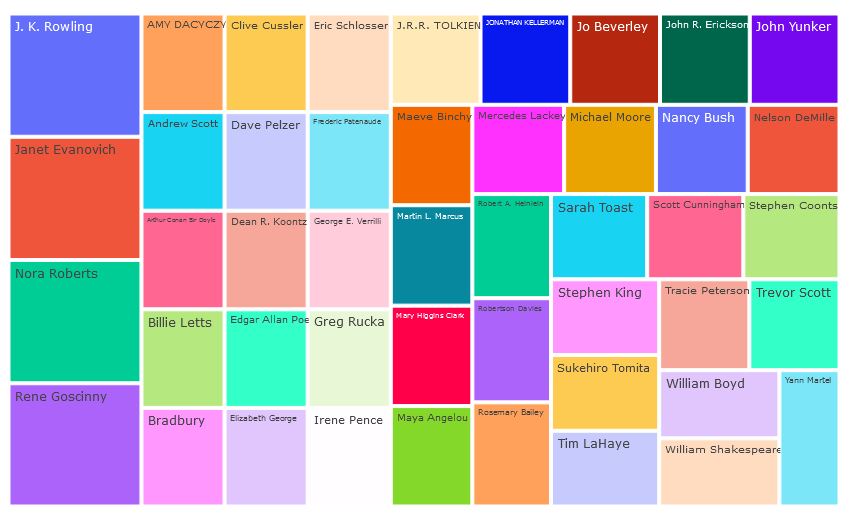
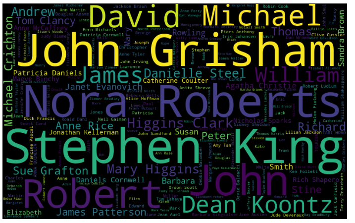
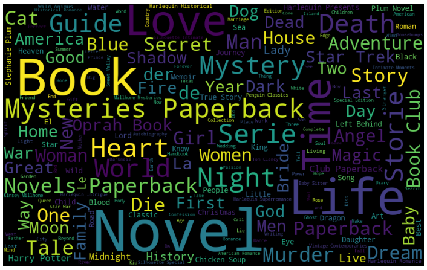
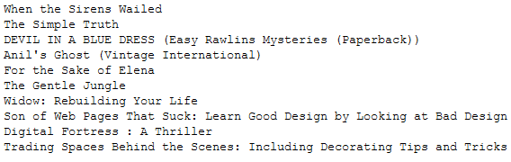
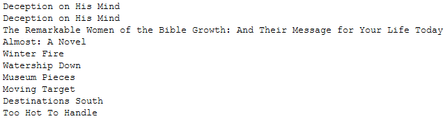
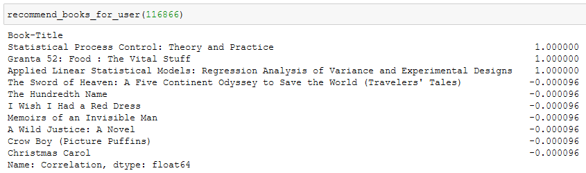
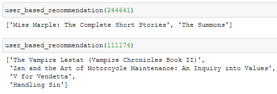

### Problem Statement
As more and more users have become online readers and it is important to find books that are appealing to you. It is often hard to figure out how good a book is by its cover. This is where the user ratings and recommendation systems come into play. It is crucial that online reading platform vendors get recommend good books to their users, so they keep coming back to the site. In this analysis, I am trying to build a simple book recommendation system that can be extended to a real-world scenario. 

### Method
For this analysis I am using a dataset taken from Kaggle. This data set consists of three separate data files and one of them has 900k+ records. Altogether there are 8 variables and only 5 of them are useful to work with as others are related to images and we are not going to perform any image analysis here. I am using both content based and collaborative filtering to build the recommendation system. 

•	Loading Data – This should have been a simple task. Unfortunately, in this case one of the CSV files had semicolon as the column separator and the same file had many string values that contained semicolons. Parsing through the file to extract all the columns accurately took an enormous amount of time and effort.  

```
users = pd.read_csv('BX-Users.csv', sep=';', encoding='latin-1')
users.head()
import csv

datafile = open('BX-Books.csv', 'r', encoding='latin-1')
myreader = csv.reader(datafile)

data = []

for row in myreader:
    line = ''
    for col in range(22): # Checking for first 22 columns
        if row[col] != '':
            line = line + row[col]
        else:
            break
      data.append(line.strip())
datafile.close()

# removing ampersands
new_data = []
remove_list = ['Edith Delatush',
 'Dylan Thomas',
 'Dougal Robertson',
 …. Rest of the list omitted for brevity ]

for n in data:
    append = True
    for x in remove_list:
        if x in n:
            append = False
            break
    if append:
        new_data.append(n.replace("&amp;", "&").replace(";:", ":").replace(" ; ", " ").replace("; ", " ").replace("&lt;", "<").replace(';\\', ":").replace('g;', "g"))

# Creating the dataframe from list
books = pd.DataFrame([sub.split(";") for sub in new_data])

# Removing empty columns
cols = [8]
books.drop(books.columns[cols],axis=1,inplace=True)

# extracting the column names form the first line
books.columns=books.iloc[0]
books = books[1:]

# Removing quotes from column names
rm_quote = lambda x: x.replace('"', '')
books = books.rename(columns=rm_quote)

# Removing quotes from the entire dataset
books = books.applymap(lambda x: x.replace('"', '') if (isinstance(x, str)) else x)
books.head()
```

•	Data Cleanup – Had to cleanup some null values and replace them with other values such as the average for the ‘Age’ column. Deleted two lines that had ,none. Values for most of the columns.  

```
users.isnull().sum()
users['Age'] = users['Age'].fillna(34.5)

books.isnull().sum()
books.drop(books.index[84125], inplace=True)
books.reset_index(inplace=True)
```

•	Merging datasets – Three separate datasets for users, books, and ratings were merged into one for ease of analysis.

```
df = pd.merge(users, ratings, on='User-ID', left_index=False)
df = pd.merge(df, books, on='ISBN', left_index=False, right_index=False)
del df['index']
df.head()
```

•	Next, I started exploring the dataset by using visualization techniques. 

```
df = df.sample(n = 50000)
temp_Age = df[df['Age'] < 80]
temp_Book_Rating = df[df['Book-Rating'] > 0]
temp_YoP = df[df['Year-Of-Publication'] > 1960][df['Year-Of-Publication'] < 2010]

fig, axes = plt.subplots(nrows = 1, ncols = 3, figsize=(20, 5))
axes[0].hist(df[df['Age'] < 80]['Age'])
axes[0].set_title("Age Distribution")
axes[1].hist(df[df['Book-Rating'] > 0]['Book-Rating'])
axes[1].set_title("Rating Distribution")
axes[2].hist(df[df['Year-Of-Publication'] > 1960][df['Year-Of-Publication'] < 2010]['Year-Of-Publication'])
axes[2].set_title("Published Year Distribution")
```



•	I used a tree map to visualize top books and top authors. 

```
top_rated = df.sort_values('Book-Rating', ascending=False)
tf_top_rated = top_rated[:25]
fig = px.treemap(tf_top_rated, path=['Book-Title'], values='Book-Rating',title='Top Rated Books', width=1000, height=700)
fig.show()

fifty_top_authors = top_rated[:50]
fig = px.treemap(fifty_top_authors, path=['Book-Author'], values='Book-Rating',title='Top Authors', width=1000, height=700)
fig.show()
```



•	I also used wordclouds to better visualize top authors and books.

```
stop_words=set(STOPWORDS)

def wordcloud(string):
    wc = WordCloud(width=800,height=500,mask=None,random_state=21, max_font_size=110,stopwords=stop_words).generate(string)
    fig=plt.figure(figsize=(16,8))
    plt.axis('off')
    plt.imshow(wc)

# word cloud for authors
authors = " ".join(df['Book-Author'])
wordcloud(authors)
```



```
books = " ".join(df['Book-Title'])
wordcloud(books)
```



•	Next, I started working on my models. I used cosine similarity for content-based filtering. Again, I had to pick a tiny subset of the dataset as my machine couldn’t handle at least 10% of the dataset with these models. I also used the TFIDF vectorizer with method.

```
subdf = df.sample(n = 2000)
content = subdf[['Book-Title','Book-Author','Book-Rating']]
content = content.astype(str)
content['content'] = content['Book-Title'] + ' ' + content['Book-Author'] + ' ' + content['Book-Rating']
content = content.reset_index()
indices = pd.Series(content.index, index=content['Book-Title'])

tfidf = TfidfVectorizer(stop_words='english')

#Construct the required TF-IDF matrix by fitting and transforming the data
tfidf_matrix = tfidf.fit_transform(content['Book-Author'])

#Output the shape of tfidf_matrix
tfidf_matrix.shape

cosine_sim_author = linear_kernel(tfidf_matrix, tfidf_matrix)

def get_recommendations_books(title, cosine_sim=cosine_sim_author):
    idx = indices[title]

    # Get the pairwsie similarity scores of all books with that book
    sim_scores = list(enumerate(cosine_sim_author[idx]))

    # Sort the books based on the similarity scores
    sim_scores = sorted(sim_scores, key=lambda x: x[1], reverse=True)

    # Get the scores of the 10 most similar books
    sim_scores = sim_scores[1:11]

    # Get the book indices
    book_indices = [i[0] for i in sim_scores]

    # Return the top 10 most similar books
    return list(content['Book-Title'].iloc[book_indices])


def author_book_shows(book):
    for book in book:
        print(book)

books = get_recommendations_books('The Prodigy', cosine_sim_author)
author_book_shows(books)
```



•	Then I tried the content-based filtering again, but this time with the count vectorizer.

```
count = CountVectorizer(stop_words='english')
count_matrix = count.fit_transform(content['content'])

cosine_sim_content = cosine_similarity(count_matrix, count_matrix)

def get_recommendations(title, cosine_sim=cosine_sim_content):
    idx = indices[title]

    # Get the pairwsie similarity scores of all books with that book
    sim_scores = list(enumerate(cosine_sim_content[idx]))

    # Sort the books based on the similarity scores
    sim_scores = sorted(sim_scores, key=lambda x: x[1], reverse=True)

    # Get the scores of the 10 most similar books
    sim_scores = sim_scores[1:11]

    # Get the book indices
    book_indices = [i[0] for i in sim_scores]

    # Return the top 10 most similar books
    return list(content['Book-Title'].iloc[book_indices])

def book_shows(book):
    for book in book:
        print(book)

books = get_recommendations('The Prodigy', cosine_sim_content)
book_shows(books)
```



•	Finally, I used the collaborative filtering method. Since we have a really sparse dataset I removed zero rated entries from ‘users’ dataframe before merging it with others.

```
nonzero_ratings = ratings[ratings['Book-Rating'] != 0]
df = pd.merge(users, nonzero_ratings, on='User-ID', left_index=False)
df = pd.merge(df, books, on='ISBN', left_index=False, right_index=False)
del df['index']
df.head()
```

•	Next, I picked a random sample of 20k records from the original merged dataframe as the original dataframe was too big for my machine to process.

```
subdf = df.sample(n = 20000)
rating = subdf.pivot_table(index='User-ID', values='Book-Rating', columns='Book-Title').fillna(0)
```

•	There are multiple methods that can be used with collaborative filtering. They belong to two categories namely, memory based and model based. Here I am trying the memory-based model first with an item based approach and then with a user based approach.

```
def user_rated_books(userID):
    temp = subdf[subdf['User-ID'] == userID][['Book-Rating', 'Book-Title']]
    
    # picking only the books where user has rated 3 or above
    temp = temp[temp['Book-Rating'] >= 3]
    
    # if the user has not rated any book 3 or above 
    if temp.empty:
        temp = temp[temp['Book-Rating']]
    
    # if the user has not rated any book at all 
    if temp.empty:
        temp = temp[temp['Book-Rating']]
    
    return temp
    
def recommend_similar_books(book):
    temp_ratings = rating[book]
    books_like_temp = rating.corrwith(temp_ratings)
    corr_temp = pd.DataFrame(books_like_temp, columns=['Correlation'])
    corr_temp.dropna(inplace=True)
    return corr_temp.sort_values('Correlation', ascending=False).head(10)

def recommend_books_for_user(userID):
    book_df = pd.DataFrame()
    rated_book_list = user_rated_books(userID)
    
    if rated_book_list.empty:
        print("This user has no rated any book to correlate")
    elif len(rated_book_list) == 1:
        recommend_similar_books(rated_book_list['Book-Title'].values[0])
    else:
        if len(rated_book_list) > 3:
            rated_book_list = rated_book_list.sort_values('Book-Rating', ascending=False)[:3]
            
        for x in rated_book_list['Book-Title'].values:
            book_df = book_df.append(recommend_similar_books(x))
            
        book_df['Book-Title'] = book_df.index
        book_df = book_df.drop_duplicates(subset='Book-Title', keep="first")
        return book_df.sort_values('Correlation', ascending=False)['Correlation'].head(10)      
```

•	Below is an output from a test case. The idea behind this approach is that we pick books where the user has rated more than 3. This is an arbitrary value. You can set it for a much higher value if you want. Then we find books that have a very good correlation with that book based on the pivot table we produced before.



•	Next, I tried the user-based approach. Here again I pick some books that the give user has rated high. Then I find other users who have rated the same book similar or higher. Then I find similar or higher rated books for those users and combine them into a single list. There is a lot finer tuning needed for this phase, for a real-world implementation.

```
def find_similar_users(userID):
    temp = subdf[subdf['User-ID'] == userID][['User-ID', 'Book-Rating', 'Book-Title']]
    temp = temp.sort_values('Book-Rating', ascending=False).head(3) 
    
    # picking only the books where user has rated 3 or above
    temp = temp[temp['Book-Rating'] >= 3]
    
    user_list = []
    
    # if the user has not rated any book 3 or above
    if len(temp) < 3:
        val = len(temp)
    else:
        val = 3
    
    if not temp.empty:
        for n in range(val):
            rating = temp['Book-Rating'].values[n]
            temp = subdf[subdf['Book-Title'] == temp['Book-Title'].values[0]]
            temp = temp[temp['User-ID'] != userID]
            
            if not temp.empty:
                temp2 = temp[temp['Book-Rating'] == rating]
                if temp2.empty:
                    temp2 = temp[temp['Book-Rating'] > rating]
            
            if not temp2.empty:
                user_list.append(temp2['User-ID'][:3].values)
    return user_list[0]

def get_books_from_similar_users(user_list):
    book_list = []
    for x in user_list:
        temp = subdf[subdf['User-ID'] == x][['Book-Rating', 'Book-Title']]
        temp = temp.sort_values('Book-Rating', ascending=False)['Book-Title'].head(3)
        temp = list(temp.values)
        for n in temp:
            book_list.append(n)
        
    book_list = list(set(book_list))
    
    return book_list[:10]
    
def user_based_recommendation(userID):
    user_list = list(find_similar_users(userID))
    
    if user_list:
        return get_books_from_similar_users(user_list)
    else:
        print("Not enough information to make user based recommendations for this user"
```

•	Here are two test cases for the user-based approach.



•	I couldn’t do any analysis on the accuracy of these models. Using metrics such as precision and recall we can measure some amount of accuracy but eventually how successful your recommendations are going to depend on the end user input, which is the best way to measure your models.


### Conclusion
Recommendation systems play a major role in online streaming, movies, retail, and almost any industry. Any e-commerce platform relies heavily on recommendations to increase their sales and in the case of streaming music and videos, to keep users coming back to the site. Book recommendation is no different. Every reader has their own taste and they would be happier if they can find books of similar type. In this analysis I used both content based filtering and collaborative filtering to recommend books to users. Content based method worked well with a single variable as well as with multiple. Collaborative method produced unpredictable results. This is an area that I have to improve.

### Important Files
Full report - [Book Rating Analysis](https://github.com/dasun27/DSC/blob/master/files/Project_2_Report_Dasun_Wellawalage.pdf)  
Dataset - [Kaggle](https://www.kaggle.com/ruchi798/bookcrossing-dataset)

### References
•	https://rpubs.com/mswofford/goordreads  

This is an analysis on book ratings from Goodreads which is a popular literary social media site that catalogs books, provides a platform for ratings and reviews, and helps users find their next book to read based on their interests and the recommendations of other users.  

•	https://techxplore.com/news/2018-09-behavior-goodreads-amazon-bestsellers.html  

This is an analysis of book reading behavior on Goodreads to predict Amazon Bestsellers.  

•	https://www.readkong.com/page/analyzing-social-book-reading-behavior-on-goodreads-and-how-5273289?p=2  

This is an analysis of Social Book Reading Behavior on Goodreads and how it predicts Amazon Best Sellers.  

•	https://www.kaggle.com/ammukp/bookreviews-visualization  

This is a visualization effort on the book ratings dataset found on Kaggle.  

•	https://www.kaggle.com/viktorpolevoi/book-crossing-data-preparation-viz  

This is a data preparation & visualization notebook on the book ratings dataset found on Kaggle.  

•	 https://www.kaggle.com/chirantansayan/book-crossing-eda-and-recommender  

This is an effort to build a collaborative filter-based recommendation system for this book ratings dataset found on Kaggle.  

•	 https://www.kaggle.com/akashdotcom/book-crossing-eda-and-recommendation-model-knn  

This is another effort to build a book recommendation system using KNN for this book ratings dataset found on Kaggle.  

•	 https://www.kaggle.com/drfrank/book-review-ratings-data-analysis-visualization  

This is a complete analysis on this book rating dataset that uses  many different analytics techniques.  

•	 https://towardsdatascience.com/building-a-content-based-book-recommendation-engine-9fd4d57a4da  

This is an effort to build a content-based book recommendation system.  

•	 https://towardsdatascience.com/my-journey-to-building-book-recommendation-system-5ec959c41847  

This is another effort to build a book recommendation system using collaborative filtering.
