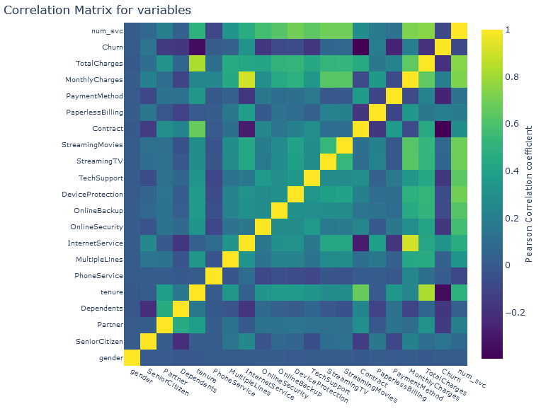

### Problem Statement
As more and more users have become online readers and it is important to find books that are appealing to you. It is often hard to figure out how good a book is by its cover. This is where the user ratings and recommendation systems come into play. It is crucial that online reading platform vendors get recommend good books to their users, so they keep coming back to the site. In this analysis, I am trying to build a simple book recommendation system that can be extended to a real-world scenario. 

### Method
For this analysis I am using a dataset taken from Kaggle. This data set consists of three separate data files and one of them has 900k+ records. Altogether there are 8 variables and only 5 of them are useful to work with as others are related to images and we are not going to perform any image analysis here. I am using both content based and collaborative filtering to build the recommendation system. 

•	Checking for null values and missing values – Most of the ML algorithms will give you errors if there are non-numeric values and even those that take categorical values will not tolerate missing or null values. In my dataset there were no missing or null values.  

```
data = pd.read_csv('datasets_13996_18858_WA_Fn-UseC_-Telco-Customer-Churn.csv')
data.dtypes
data.isnull().sum()
```



### Conclusion
Recommendation systems play a major role in online streaming, movies, retail, and almost any industry. Any e-commerce platform relies heavily on recommendations to increase their sales and in the case of streaming music and videos, to keep users coming back to the site. Book recommendation is no different. Every reader has their own taste and they would be happier if they can find books of similar type. In this analysis I used both content based filtering and collaborative filtering to recommend books to users. Content based method worked well with a single variable as well as with multiple. Collaborative method produced unpredictable results. This is an area that I have to improve.

### Important Files
Full report - [Book Rating Analysis](https://github.com/dasun27/DSC/blob/master/files/Project_2_Report_Dasun_Wellawalage.pdf)  
Dataset - [Kaggle](https://www.kaggle.com/ruchi798/bookcrossing-dataset)

### References
•	https://rpubs.com/mswofford/goordreads  

This is an analysis on book ratings from Goodreads which is a popular literary social media site that catalogs books, provides a platform for ratings and reviews, and helps users find their next book to read based on their interests and the recommendations of other users.  

•	https://techxplore.com/news/2018-09-behavior-goodreads-amazon-bestsellers.html  

This is an analysis of book reading behavior on Goodreads to predict Amazon Bestsellers.  

•	https://www.readkong.com/page/analyzing-social-book-reading-behavior-on-goodreads-and-how-5273289?p=2  

This is an analysis of Social Book Reading Behavior on Goodreads and how it predicts Amazon Best Sellers.  

•	https://www.kaggle.com/ammukp/bookreviews-visualization  

This is a visualization effort on the book ratings dataset found on Kaggle.  

•	https://www.kaggle.com/viktorpolevoi/book-crossing-data-preparation-viz  

This is a data preparation & visualization notebook on the book ratings dataset found on Kaggle.  

•	 https://www.kaggle.com/chirantansayan/book-crossing-eda-and-recommender  

This is an effort to build a collaborative filter-based recommendation system for this book ratings dataset found on Kaggle.  

•	 https://www.kaggle.com/akashdotcom/book-crossing-eda-and-recommendation-model-knn  

This is another effort to build a book recommendation system using KNN for this book ratings dataset found on Kaggle.  

•	 https://www.kaggle.com/drfrank/book-review-ratings-data-analysis-visualization  

This is a complete analysis on this book rating dataset that uses  many different analytics techniques.  

•	 https://towardsdatascience.com/building-a-content-based-book-recommendation-engine-9fd4d57a4da  

This is an effort to build a content-based book recommendation system.  

•	 https://towardsdatascience.com/my-journey-to-building-book-recommendation-system-5ec959c41847  

This is another effort to build a book recommendation system using collaborative filtering.
