### Problem Statement
User feedback is quite important in any business and specially, in online businesses. Simply because other users read these feedbacks before deciding to use your product or service. Social media platforms like Twitter play a major role in advertising today. Thus, it is quite important to make sure the overall sentiment for your products and services remain positive on these platforms. Passengers had a negative sentiment about most US airlines for quite some time. However, due to some recent events related to passenger safety and customer service, this negative sentiment has increased. I am trying to build a model to predict the user sentiment based on their Twitter comments, which can then be used to analyze find ways to improve the service. 

### Method
Based on the dataset there are a few methods I can use to analyze this. There is a specific column that has already identified each sentiment as positive, negative, or neutral and there is confidence rating associated too. Initially I was planning to do some regression analysis based on other features like user’s location, time zone etc. But most of those features had a lot of null values. Hence, I decided to base my analysis on text field alone at which point it became a text analysis project. 


• Loading Data – This was easy as there was only one data file which was a CSV.  

```
data = pd.read_csv('Tweets.csv')
data.head()
```

• Data Cleanup – There were a few columns with a lot of null values. I dropped some of those and replaced the rest with arbitrary values.  

```
data.isnull().sum()
```

• Drop & Replace – I dropped some columns that didn’t have much values and replaced the null values in others. Most sentiments had a confidence rating of 1 while others had something close to that. I chose to omit the sentiments with a confidence rating below 0.5 arbitrarily.

```
data.drop(['airline_sentiment_gold', 'negativereason_gold', 'tweet_coord'], axis=1, inplace=True)

# Replacing NaNs in 'negativereason_confidence' with 0
data['negativereason_confidence'] = data['negativereason_confidence'].fillna(0)

# Removing records with less than 0.5 sentiment confidence rating
ds = data[data['airline_sentiment_confidence'] > 0.5]

# Replacing remaining null values with arbitrary values
ds['negativereason'] = ds['negativereason'].fillna('NoReason')
ds['tweet_location'] = ds['tweet_location'].fillna('NoLocation')
ds['user_timezone'] = ds['user_timezone'].fillna('NoTimezone')

# Removing 'retweet_count' column as well as it is mostly zeros.
ds.drop(['retweet_count'], axis=1, inplace=True)
```

• Data Exploration – Here, I used some visualization techniques to explore this dataset. First, I checked for unique values in each column. Based on that ‘airline’ and ‘negativereason’ seemed good for visualizations. 

```
for x in list(ds.columns):
    print(x, ":", len(ds[x].unique()))temp_Age = df[df['Age'] < 80]
```

• Visualizing airline sentiments - As you can see in the histogram below, a vast majority of sentiments about US airlines were negative. You will see how this affects the model accuracy later in the analysis. 

```
fig, axes = plt.subplots(nrows = 1, ncols = 2, figsize=(20, 5))

axes[0].hist(ds['airline_sentiment'])
axes[0].set_title("Airline Sentiment")
axes[1].hist(ds['airline_sentiment_confidence'])
axes[1].set_title("Airline Sentiment Confidence") 
```

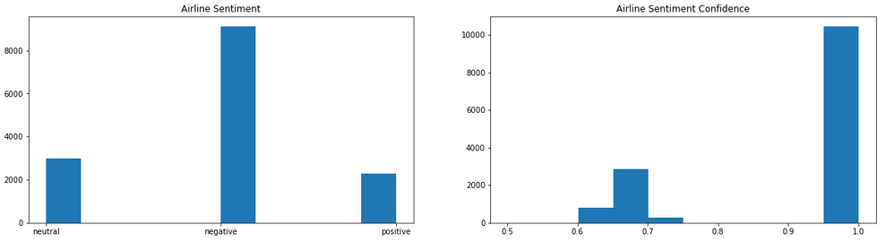

• Visualizing negative reasons – Customer service, late flights, and cancelled flights seem to have the biggest effect on the customer dissatisfaction.  

```
plt.hist(ds[ds['negativereason'] != 'NoReason']['negativereason'])
plt.xticks(rotation=90
```

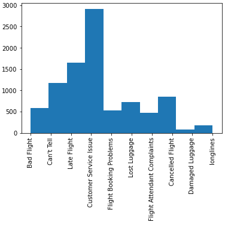

• Visualizing Tweet sentiment by airline – These histograms might not give you a correct at the first glance. For example, if you compare ‘Virgin America’ with ‘United’ you might think that ‘Virgin America’ is far better but please note the number of total tweets as well. ‘United’ has close to 4000 tweets while ‘Virgin America’ has less than thousand tweets. 

```
ds['airline'].unique()
airlines = ['Virgin America', 'United', 'Southwest', 'Delta', 'US Airways', 'American']

fig, axes = plt.subplots(nrows = 2, ncols = 3, figsize=(20, 10))
rows = 0
cols = 0
Index = [1,2,3]

for x in airlines:
    count = ds[ds['airline'] == x]['airline_sentiment'].value_counts()
    axes[rows, cols].bar(Index,count, color=['red', 'green', 'blue'])
    axes[rows, cols].set_xticks(Index)
    axes[rows, cols].set_xticklabels(['negative','neutral','positive'])
    axes[rows, cols].set_title(x)
    
    if cols < 2:
        cols += 1
    else:
        rows += 1
        cols = 0
```

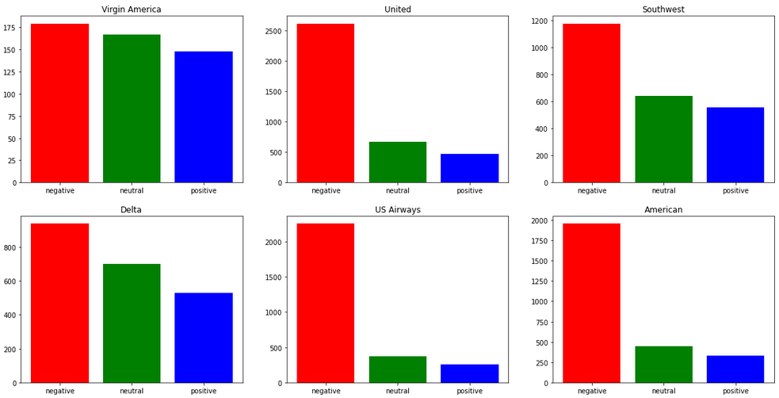

• Visualizing Tweet count by airline – This is to understand that some airlines naturally have more negative sentiments based on their total number of tweets. 

```
tweet_count = []

for x in airlines:
    tweet_count.append(len(ds[ds['airline'] == x]))
    
tweet_count

plt.bar(airlines,tweet_count)
plt.xticks(rotation=90)
plt.title('Total tweet count by airline')
```

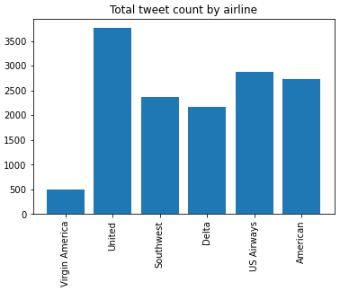

• Visualizing negative reasons by airline – This is if you are interested in specific negative reasons and want to drill down on how one airline does compared to the others.  

```
ds[ds['negativereason'] != 'NoReason']['negativereason'].unique()
reasons = ['Bad Flight', "Can't Tell", 'Late Flight', 'Customer Service Issue', 'Flight Booking Problems',
       'Lost Luggage', 'Flight Attendant Complaints', 'Cancelled Flight', 'Damaged Luggage', 'longlines']

fig, axes = plt.subplots(nrows = 2, ncols = 5, figsize=(12, 8))
rows = 0
cols = 0
Index = [1,2,3,4,5,6]

for x in reasons:
    count = ds[ds['negativereason'] == x]['airline'].value_counts()
    axes[rows, cols].bar(Index, count)
    axes[rows, cols].set_xticks(Index)
    plt.setp(axes[rows, cols].xaxis.get_majorticklabels(), rotation=90)
    axes[rows, cols].set_xticklabels(list(count.index))
    axes[rows, cols].set_title(x)

    if cols < 4:
        cols += 1
    else:
        rows += 1
        cols = 0
        
plt.tight_layout(rect=[0, 0, 1, 1])
```

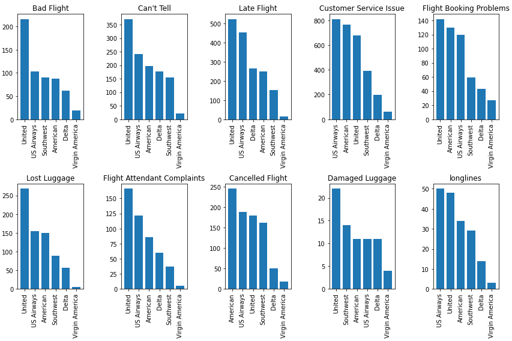

• Wordcloud for negative reasons – This is an easy way to spot comments about which specific words contribute most to the overall negative sentiment. It clearly shows how words like ‘flights’, ‘hour’, ‘bag’, ‘time’, and ‘customer service’ are more prominent than the others 

```
def make_wordcloud(sentiment):
    words = ' '.join(ds[ds['airline_sentiment']==sentiment]['text'])

    cleaned_word = " ".join([word for word in words.split()
                                if 'http' not in word
                                    and not word.startswith('@')
                                ])

    wordcloud = WordCloud(stopwords=STOPWORDS,
                          background_color='black',
                          width=3000,
                          height=2500
                         ).generate(cleaned_word)

    plt.figure(1,figsize=(15, 12))
    plt.imshow(wordcloud)
    plt.axis('off')
    plt.show()

make_wordcloud('negative')
```

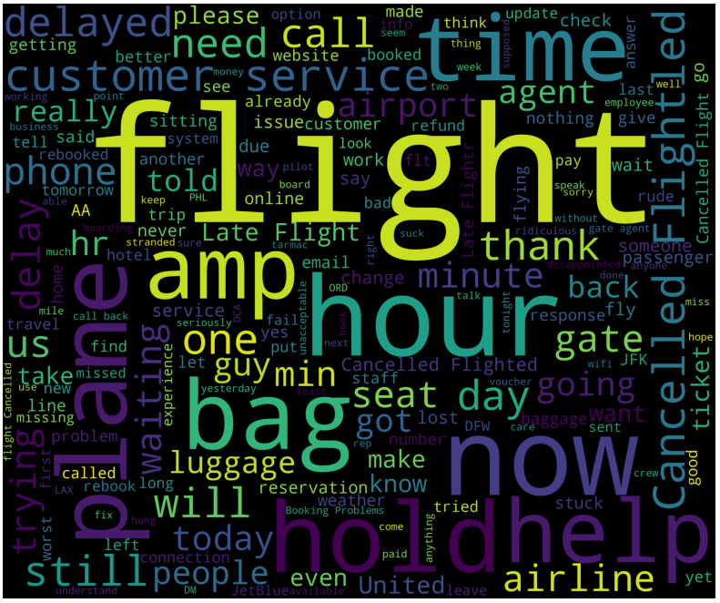

• Modeling – First, I started with some classifiers to predict the sentiment. I used three different classifiers in my analysis. Using the Decision Tree classifier, I managed to achieve 68% accuracy. Also, you can see that negative sentiments have a 80% accuracy while positive and neutral ones have much less accuracy. 

```
from sklearn.feature_extraction.text import CountVectorizer

def cleaned_tweets(tweet):
    words = re.sub("[^a-zA-Z]", " ",tweet).lower().split()                                        
    sentence = [x for x in words if not x in STOPWORDS] 
    return( " ".join(sentence))

# Creating new column with clean text
ds['clean_text']=ds['text'].apply(lambda x: cleaned_tweets(x)) 

train,test = train_test_split(ds,test_size=0.2,random_state=5)

CV = CountVectorizer(analyzer = "word")
train_features = CV.fit_transform(list(train['clean_text']))
test_features = CV.transform(list(test['clean_text']))

classifier = DecisionTreeClassifier()
Accuracy=[]
Model=[]

def cleaned_tweets(classifier):
    fit = classifier.fit(train_features,train['airline_sentiment'])
    pred = fit.predict(test_features)
    accuracy = accuracy_score(pred,test['airline_sentiment'])
    Accuracy.append(accuracy)
    Model.append(classifier.__class__.__name__)
    print('Accuracy of '+classifier.__class__.__name__+'is '+str(accuracy))
    print(classification_report(pred,test['airline_sentiment']))
    cm=confusion_matrix(pred , test['airline_sentiment'])
    plt.figure()
    plot_confusion_matrix(cm,figsize=(12,8), hide_ticks=True,cmap=plt.cm.Reds)
    plt.xticks(range(2), ['Negative', 'Neutral', 'Positive'], fontsize=16,color='black')
    plt.yticks(range(2), ['Negative', 'Neutral', 'Positive'], fontsize=16)
    plt.show()

cleaned_tweets(classifier)
```

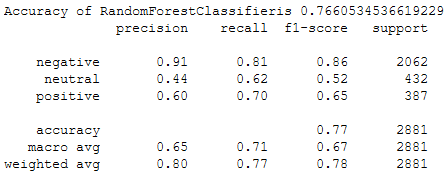

• I got a somewhat similar accuracy of 74% using the Linear SVM classifier. 

```
from scipy.sparse import hstack

cv = CountVectorizer(ngram_range=(1,2))
vectorized_data = cv.fit_transform(ds['clean_text'])
indexed_data = hstack((np.array(range(0,vectorized_data.shape[0]))[:,None], vectorized_data))

def sentiment2target(sentiment):
    return {
        'negative': 0,
        'neutral': 1,
        'positive' : 2
    }[sentiment]

targets = ds['airline_sentiment'].apply(sentiment2target)

data_train, data_test, targets_train, targets_test = train_test_split(indexed_data, targets, test_size=0.4, 
                                                                      random_state=0)
data_train_index = data_train[:,0]
data_train = data_train[:,1:]
data_test_index = data_test[:,0]
data_test = data_test[:,1:]

from sklearn import svm
from sklearn.multiclass import OneVsRestClassifier

clf = OneVsRestClassifier(svm.SVC(gamma=0.01, C=100., probability=True, class_weight='balanced', kernel='linear'))
clf_output = clf.fit(data_train, targets_train)

# Model evalutation
clf.score(data_test, targets_test)
```

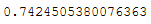

• Next, I used Deep Learning models. First, I tried a sequential model with embeddings. As you can see, I couldn’t produce good results with this. Probably if I clean up the tweets better and do more fine tuning it will produce better results.

```
train,test = train_test_split(ds,test_size=0.2,random_state=5)

from keras.preprocessing.text import Tokenizer
from keras.preprocessing.sequence import pad_sequences
from keras.models import Sequential
from keras.layers import Embedding, Flatten, Dense

train_texts = list(train['clean_text'])

def sentiment2target(sentiment):
    return {
        'negative': 0,
        'neutral': 1,
        'positive' : 2
    }[sentiment]

targets = train['airline_sentiment'].apply(sentiment2target)
train_labels = list(targets)

maxlen = 100
training_samples = 9500
validation_samples = 2000
max_words = 10000

tokenizer = Tokenizer(num_words=max_words)
tokenizer.fit_on_texts(train_texts)
sequences = tokenizer.texts_to_sequences(train_texts)

word_index = tokenizer.word_index
data = pad_sequences(sequences, maxlen=maxlen)

train_labels = np.asarray(train_labels)

indices = np.arange(data.shape[0])
np.random.shuffle(indices)
data = data[indices]
train_labels = train_labels[indices]

x_train = data[:training_samples]
y_train = train_labels[:training_samples]
x_val = data[training_samples: training_samples + validation_samples]
y_val = train_labels[training_samples: training_samples + validation_samples]

embedding_dim = 100

model = Sequential()
model.add(Embedding(max_words, embedding_dim, input_length=maxlen))
model.add(Flatten())
model.add(Dense(32, activation='relu'))
model.add(Dense(1, activation='sigmoid'))

model.compile(optimizer='rmsprop', loss='binary_crossentropy', metrics=['acc'])

history = model.fit(x_train, y_train,
                    epochs=10,
                    batch_size=32,
                    validation_data=(x_val, y_val))

# Evaluating the model
test_texts = list(test['clean_text'])

def sentiment2target(sentiment):
    return {
        'negative': 0,
        'neutral': 1,
        'positive' : 2
    }[sentiment]

targets = test['airline_sentiment'].apply(sentiment2target)
test_labels = list(targets)

sequences = tokenizer.texts_to_sequences(test_texts)
x_test = pad_sequences(sequences, maxlen=maxlen)
y_test = np.asarray(test_labels)

model.evaluate(x_test, y_test)
```

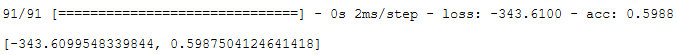

• Following that, I tried another deep learning model with a LSTM layer. This time the accuracy increased to 66% but this is still less accurate than the classifiers.

```
from keras.layers import LSTM

max_features = 10000
model = Sequential()
model.add(Embedding(max_features, 32))
model.add(LSTM(32))
model.add(Dense(1, activation='sigmoid'))

model.compile(optimizer='rmsprop', loss='binary_crossentropy', metrics=['acc'])

history = model.fit(x_train, y_train,
                    epochs=10,
                    batch_size=128,
                    validation_data=(x_val, y_val))

model.evaluate(x_test, y_test)
```

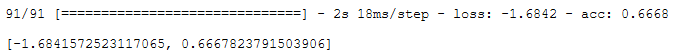

• Finally, I tried a deep learning model with a simple 1D convnet. This model actually had worse results than the previous two. Overall, Random forest classifier and Linear SVM classifier got the best results with this dataset. Perhaps, deep learning models will perform better with a much larger dataset.

```
from keras import layers
from keras.optimizers import RMSprop

max_len = 100

model = Sequential()
model.add(layers.Embedding(max_features, 128, input_length=max_len))
model.add(layers.Conv1D(32, 7, activation='relu'))
model.add(layers.MaxPooling1D(5))
model.add(layers.Conv1D(32, 7, activation='relu'))
model.add(layers.GlobalMaxPooling1D())
model.add(layers.Dense(1))

model.compile(optimizer=RMSprop(lr=1e-4), loss='binary_crossentropy', metrics=['acc'])

history = model.fit(x_train, y_train,
                    epochs=10,
                    batch_size=128,
                    validation_data=(x_val, y_val))

model.evaluate(x_test, y_test)
```

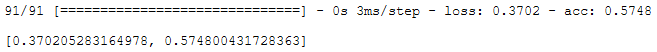


### Conclusion
In the recent past we have seen a lot of negative sentiment towards the US airline service due to some controversial incidents. Not just in US, but overall, in the entire world, most people are dissatisfied with the airline service. My goal in this analysis was to build a model that can accurately predict the overall sentiment of a user tweet based on the raw text. I used both classifiers and deep learning models to analyze and I got the best results using a Random forest classifier and a Linear SVM classifier on their own. Both the models had better accuracy levels with negative sentiments as a vast majority of comments were negative. We can probably improve the accuracy with a much larger dataset, so we have enough positive and neutral records to improve on. Further, we can do more cleaning on the raw text, so we extract only the most meaningful words. One should be able to use these models in a real-world environment as well.

### Important Files
Full report - [Twitter US Airline Sentiment Analysis](https://github.com/dasun27/DSC/blob/master/files/Project_3_Report_Dasun_Wellawalage.pdf)  
Dataset - [Kaggle](https://www.kaggle.com/crowdflower/twitter-airline-sentiment)

### References
•	https://www.geeksforgeeks.org/twitter-sentiment-analysis-using-python/  

This article covers the sentiment analysis of any topic by parsing the tweets fetched from Twitter using Python.  

•	https://towardsdatascience.com/twitter-sentiment-analysis-classification-using-nltk-python-fa912578614c  

This is a Twitter sentiment analysis attempt using natural language processing techniques.  

•	https://www.pluralsight.com/guides/building-a-twitter-sentiment-analysis-in-python  

Another Twitter sentiment analysis using Python based machine learning libraries.  

•	https://medium.com/@francesca_lim/twitter-u-s-airline-sentiment-analysis-using-keras-and-rnns-1956f42294ef  

This is a Twitter U.S. Airline Sentiment Analysis using Keras and RNNs.  

•	https://www.datasciencecentral.com/profiles/blogs/sentiment-analysis-of-airline-tweets  

This is a detailed guide on sentiment analysis for airline tweets.  

•	https://ipullrank.com/step-step-twitter-sentiment-analysis-visualizing-united-airlines-pr-crisis/  

This post goes into great lengths to explain not only the sentiment analysis process but also how to create an application to collect user sentiments.  

•	https://www.kaggle.com/parthsharma5795/comprehensive-twitter-airline-sentiment-analysis  

This is a notebook analyzing the same dataset found on Kaggle. He uses a classification approach for his analysis.  

•	https://www.kaggle.com/anjanatiha/sentiment-analysis-with-lstm-cnn  

This notebook tries to perform sentiment analysis using LSTM & CNN.  

•	 https://www.kaggle.com/mrisdal/exploring-audience-text-length  

Another effort to use audience & tweet length to perform sentiment analysis.  

•	https://www.kaggle.com/langkilde/linear-svm-classification-of-sentiment-in-tweets  

This notebook uses Linear SVM classification for sentiment analysis.  

